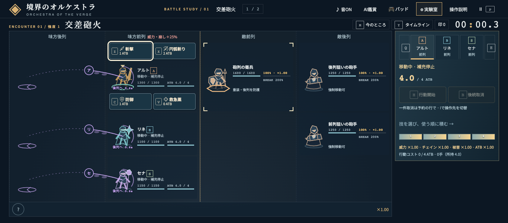

# 前後移動と戦闘姿勢

2026-09-08、ルール版 `orchestra-16`。戦闘コア、移動所要時間、対象判定、保存Stateの形式は変更していない。

画像は実装 `1da754a`、1366×600、交差砲火・強度1・ボーナスなし。味方3人を前列・ATB4・実行保留、敵の次回攻撃を999秒にした検証Stateから、一括隊列で3人を後列へ移動させた約0.3秒時点。画像の再生成は以下のブラウザテストを使う。

## 前後移動

移動指示が実際に始まると、現在位置から行先の列へ軌跡を表示し、キャラの名前の頭文字を入れた光点が進む。足元に行先と残り秒、周囲に進捗の環を表示する。予約の中にあるだけの移動は描かない。

キャラのカードと対象判定は、移動完了まで元の列に置く。軌跡の終点は行先の列を示す案内で、将来のクリック位置ではない。到着後は実際に配置された駒の足元に0.4戦闘秒の着地リングを出す。強制移動は橙色、通常移動と緊急退避は紫色で区別する。逆方向の指示による取消では途中の軌跡を消し、押し戻しや退避では確定した移動先を使う。

移動中の本人には小さな足踏みを加える。HP・名前・64×68pxの駒の外枠と周囲メニューの基準位置は固定する。読み上げには移動元・移動先と「到着までは元の列にいる」説明を関連付ける。

## 行動の姿勢

斬撃・打撃は構えから振り抜き、射撃は引きと反動、魔法・回復は杖先への集束、防御は身を低くした構えを使う。腕・武器・胴体を分けて動かし、硬直の終わりで通常姿勢へ戻す。被弾の反動は実際の結果から重ね、構えただけでは命中演出を発生させない。

## 時間と操作

移動の進捗は `Ally.move / Config.moveTime`、着地は既存moveイベントと `State.time`、戦闘姿勢は既存ActionCueの進捗から計算する。独自のタイマーや乱数を使わず、ポーズ、スロー、途中状態の復元、タイムライン、1tickずつの録画と同期する。

`prefers-reduced-motion` では移動する光点、足踏み、武器や胴体の変形を停止し、経路・行先・残り時間・静止した着地表示を残す。装飾レイヤーは入力を受け取らず、近傍メニューの要素やフォーカスを作り直さない。

moveイベントには戦闘番号がないため、着地表示は既存の「戦闘開始。」「第二戦へ。」ログ以降に限る。メッセージが変わった場合は `movement.ts` の互換処理を更新する。実際のstart/nextコマンドを使ったテストで、この境界を検証する。

## 再現

モデルは `tests/movement-effects.test.ts` と `tests/emblem-pose.test.ts`、ブラウザは `tests/e2e/movement.spec.ts` で確認する。ブラウザの検証には前進・後退、取消と敵の押し戻し、保存途中からの復元、スマホ幅と動きを減らす設定、3人同時移動と近傍メニューのフォーカス、録画の1tick進行を含む。

`E2E_PORT=5188 npx playwright test tests/e2e/movement.spec.ts --workers=3`

最終検証では、ユニット381件、E2E全121件、本番ビルド、変更ソースのPrettier、`git diff --check` が成功。通常・動きを減らす設定の画像、3人同時移動、構えと同時着弾を目視確認した。物理パッドとスクリーンリーダーの実機評価は含まない。
