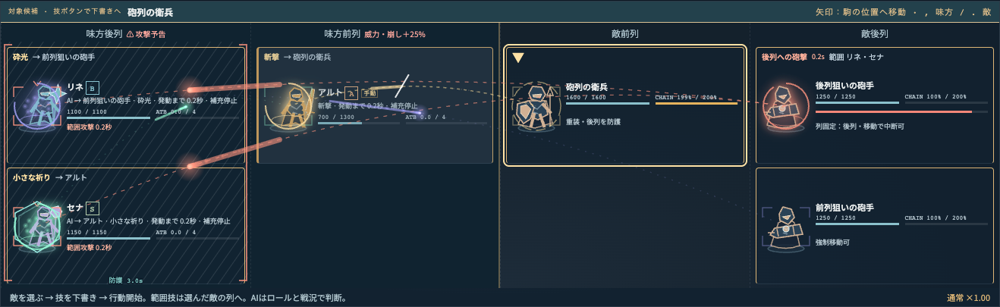
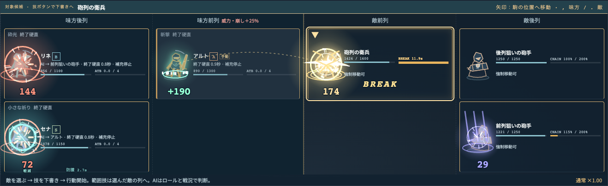

# 行動と被作用が読める戦闘演出

> 以下の描画実装と性能計測は `orchestra-13` 時点の記録です。`orchestra-14` では戦術停止を廃止し、戦闘演出は通常・スロー・休憩に従います。追加した対象の印と下書き入力エフェクトは[現行操作仕様](dual-target-controls.md)を参照してください。過去の計測条件・数値・保存画像は変更していません。

2026-09-08。実装は `orchestra-13`、描画コードの検証版は `22dc26a`。React + SVG + CSSに標準のCanvas 2Dを組み合わせた。依存ライブラリ・画像素材の追加はない。

発動前は「技名・対象・残り時間」、着弾後は「実際のダメージ／回復・防護軽減・ブレイク・移動・中断・空振り」を表示する。敵の単体攻撃は駒をロックし、範囲攻撃は現在の対象列を括る。味方の範囲技は指定済みの列と現在そこにいる対象から予告を描く。入力中の対象候補は発動中の対象とは独立する。



武器と敵種をSVGの駒で描き分け、構え・踏み込み・終了硬直・被弾の反動を付けた。発動時間の後半で斬撃の軌道、矢、魔法弾、砲弾が進む。命中した瞬間から斬撃の残像、光柱、衝撃波、火花、ブレイクの破片、回復の光、防護の反応に切り替わる。連続行動はその手数を示す。



数字は原則として駒の下部の専用帯に置く。縦の短い画面で3段になる場合は駒側へ寄せ、HP表示を避ける。戦場全体の高さはデスクトップの画面高に合わせて固定し、各列の最大人数に応じて2～3段を使う。移動で人数が変わってもコマンド欄を押し出さない。390px幅では縦に並べ、OSの「動きを減らす」で粒子と駒の反動を止めても、対象・進捗・数字・結果は残る。

## 実装の境界

- `src/client/effects/events.ts` は現在のActionと確定済みBattleEventから表示を導く純粋関数。戦闘State、乱数、HP、行動時間を変更しない。
- 行動予告と飛翔は未解決のActionだけに属する。終了硬直では再発射せず、中断された攻撃や空振りは命中粒子を出さない。
- イベントに `visual` を追加し、技ID、技名、連続手数、防護の有無、移動前後の列、撃破・中断・空振り・移動抵抗を記録した。表示文字列や後から始まった別の技から、命中した技を逆算しない。
- 描画の進捗はすべて `State.time` から計算する。通常速度・スロー・戦術停止・録画再生で一致し、独自のアニメーションタイマーを持たない。DOM測定、Canvasの描画時間、OSの設定は表示側だけで管理する。
- 粒子はCanvas 1枚に描き、対象の括り・進捗・数字はSVG、駒の反動はCSSに分担する。確定演出は直近24件まで、CanvasのDPRは2まで。Canvasに粒子数とCPU描画時間を記録するが、戦闘データには入れない。
- 移動の軌跡は記録した移動元の列から描く。実際の駒のカードは移動完了時点で配置を更新する。3D空間での歩行や衝突、モデルアニメーションは実装していない。

保存イベントの意味が変わるためVERSIONを12から13へ更新。旧版の途中Stateを再操作させず、既存の印の閲覧と遭遇開始からの比較を維持する。数値・戦闘処理順は変えていない。旧版と新版のAI戦闘を鐘楼・交差砲火・灰雨の3条件で各2400tick比較し、表示情報と版番号を除くState、乱数、イベント順・本文・値が全tick一致した。新版の入力再生と保存Stateの完全一致もテスト済み。

## 計測

`effects/baseline.json`、`effects/enhanced.json`、`effects/stress.json`、`effects/stress-dpr2.json` に各3試行の生データ、ブラウザ／CPU／OS、全ソースと配信JS/CSSのSHA-256、条件を保存する。

Apple M4 Max / macOS（Darwin 25.6.0）、Chrome 152.0.7977.76。全条件で約60fpsを維持し、50ms以上のLong Taskは0件だった。

| 条件             | フレーム間隔 p95 / p99（各3回の最大） | Canvas粒子数（観測最大） | Canvas CPU描画 p95（各3回の最大） | 25ms超フレーム |
| ---------------- | ------------------------------------- | -----------------------: | --------------------------------: | -------------: |
| 変更前・DPR1     | 16.8 / 16.8 ms                        |                 —（SVG） |                                 — |          0.00% |
| 通常戦闘・DPR1   | 16.7 / 16.8 ms                        |                      156 |                            0.2 ms |          0.00% |
| 24ブレイク・DPR1 | 16.8 / 16.8 ms                        |                      768 |                            0.3 ms |          0.00% |
| 24ブレイク・DPR2 | 16.7 / 16.8 ms                        |                      768 |                            0.3 ms |          0.00% |

通常戦闘では最大156個のCanvas粒子を観測した。768粒子を持続して描く人工条件でも、今回の環境ではフレーム低下を観測しなかった。JSのgzipサイズは147.74→152.51kB、CSSは19.03→19.91kB（合計約5.7kB増）。この範囲の2D演出には、既存スタックと標準Canvasで対応できた。

通常比較は交差砲火をAIで実行し、HPを全員50000に増やして測定中の戦闘終了を防ぐ。ATB 3/s・上限8、敵威力0.2、音OFF。高負荷試験は人工的な24個のブレイク演出を発生直後の位相に固定して毎フレーム再描画する。この人工条件は描画コストの確認用で、通常戦闘の勝敗やAIの性能は評価しない。通常の情報密度は同時着弾の固定場面と実戦UIで確認する。

本番ビルド、headless Chrome、1366×900で計測する。通常比較と高負荷はDPR1、高負荷をDPR2でも別途計測する。実時間で3秒ウォームアップ後、10秒を3回測る。フレーム間隔とLong Taskを集計し、粒子数とCanvasのCPU描画時間は15フレームおきに採取する。CanvasのCPU時間には非同期GPU処理やReact全体の描画時間は含まれない。ブラウザは約60Hzで頭打ちになるため、これをスタックの絶対的な最大性能とは扱わない。モバイル実機、DPR3、高リフレッシュレート、低性能GPUでの実測は今回の範囲外。

## 再現

```sh
npm run build
npm run preview -- --port 4173 --strictPort
# 別のターミナルで順に実行。別の負荷試験と同時に走らせない。
npx tsx scripts/effects-bench.ts /tmp/enhanced.json
EFFECTS_STRESS=1 npx tsx scripts/effects-bench.ts /tmp/stress.json
EFFECTS_STRESS=1 EFFECTS_DPR=2 npx tsx scripts/effects-bench.ts /tmp/stress-dpr2.json
npm test
npm run test:e2e
```

変更前は `45b0bd055061ee32ad8cc75a59025d9ab438d16f` を別ディレクトリへ展開し、同じ依存関係でビルドして4174番でpreviewする。現在版の測定スクリプトへ `EFFECTS_URL=http://127.0.0.1:4174 EFFECTS_VERSION=orchestra-12 EFFECTS_SOURCE_DIR=<展開先> EFFECTS_SOURCE_REF=45b0bd055061ee32ad8cc75a59025d9ab438d16f` を渡す。VERSION以外の初期入力条件は共通。

画像は `tests/e2e/effects.spec.ts` の固定スナップショットを実際のシミュレーターで進めて生成する。`test-results/effects-windup.png`、`effects-impact.png`、`effects-mobile-reduced.png` が出力される。画像は機械による正誤判定だけでなく、実表示を見て確認した。
